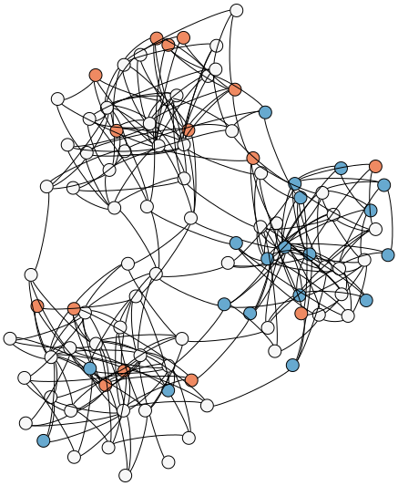

# C++ Implementation of an Agent-based Model of the Spiral of Silence
This repository contains a C++ implementation of an agent-based model (ABM) for observing opinion dynamics in networks and studying the [spiral of silence](https://en.wikipedia.org/wiki/Spiral_of_silence). 

Agents are placed on the nodes of a network with randomly assigned opinions, confidences on their opinion and an expression threshold. Agents with confidence higher than their expression threshold speak out their mind and influence neighbors in the network. Agents may consequently change their confidence over time depending on the opinion climate they observe in their immidiate neighborhood. Among other things, it was studied how such a dynamic system can cause a spiral of silence.

The implementation was used e.g. in the scientific publication
> Ross, B., Pilz, L., Cabrera, B., Brachten, F., Neubaum, G., & Stieglitz, S. (2019). Are social bots a real threat? An agent-based model of the spiral of silence to analyse the impact of manipulative actors in social networks. European Journal of Information Systems, 28(4), 394-412.

where further details on the model assumptions can be found.


*Exemplary simulation run of a model instance from the initial configuration (left) to the stable state(right).*

## Getting Started / Compilation 
The project uses a *CMake*-based build process, allowing the programs to be easily built on different platforms. We also provide a set of (more or less up-to-date) pre-built Windows binaries that can be used without compiling the source yourself on Windows.

### Dependencies
The implementation uses a few C++ libraries, most notably the [Boost Graph Library](https://www.boost.org/doc/libs/1_73_0/libs/graph/doc/index.html) for handling the network structures of the model. A local Boost installation is therefore needed for compilation. Other dependencies, such as [JSON for Modern C++](https://github.com/nlohmann/json), the [Catch 2](https://github.com/catchorg/Catch2) testing framework, the [{fmt}](https://github.com/fmtlib/fmt) formatting library and the [cxxopts](https://github.com/jarro2783/cxxopts) CLI argument parser are distributed as header-only includes in the `libs` folder.

### Compilation on Linux
The following steps describe the build process on a fresh Ubuntu 20.04 install. Other Unix variants (including OS X) should work similarly.

```
### 1. Install all dependencies 
sudo apt install git cmake build-essential libboost-dev

### 2. Obtain the source code, e.g. by cloning the repository
git clone https://github.com/bencabrera/spiral_of_silence_abm.git && cd spiral_of_silence_abm

### 3. Create a folder for the compiled binaries
mkdir bin && cd bin

### 4. Initialize CMake project
cmake -DCMAKE_BUILD_TYPE=Release ../

### 5. Start compilation
make
```

### Using the pre-built binaries on Windows
We also provide pre-built binaries for Windows that can be downloaded from the [release section](https://github.com/bencabrera/spiral_of_silence_abm/releases). Since the binaries are built with Microsoft Visual C++, you might need to install the [*Microsoft Visual C++ Redistributable for Visual Studio 2015, 2017 and 2019*](https://support.microsoft.com/en-us/help/2977003/the-latest-supported-visual-c-downloads). In this case, running the programs will fail with an indicative error message. It makes sense to try running the programs before installing the redistributable, as it might already be installed.

## Usage
The implementation consists of three command-line interface tools: `generation`, `simulation`, `param_simulation`. Each program can run with a `--help` argument to display a summary of all posssible arguments.

### generation - Generating model instances
The `generation` tool can be used to generate model instances, i.e. a network of agents, later to be used by the `simulation` tool. The mandatory `--gml-output` argument allows saving the instance as a [.gml](https://en.wikipedia.org/wiki/Graph_Modelling_Language) file. The model parameters are supplied through a JSON file, passed via the mandatory `--param-json-input` argument. A typical parameter file looks as follows:
```
{
    "bot_attachment_method": "PreferentialAttachment(1,1)",
	"bot_influence": 0.25,
    "expression_threshold_init": "Unif(0,1)",
    "inner_confidence_init": "Unif(0,1)",
    "is_directed": false,
    "n_bots": 100,
    "n_user": 1000,
    "network_model": "PreferentialAttachment(1,1)",
    "ratio_valence_green": 0.5
}
```
A more detailed description of the different options follows below in the *Parameter configuration file* section.

Consequently, a minimal (UNIX) call of the `generation` tool looks as follows:
```
./generation --param-json-input params.json --gml-output model.gml
```

### simulation - Simulating a single model instance
The `simulation` tool simulates the opinion dynamics based on model instance until a steady state is reached.

The mandatory argument `--gml-input` expects the path to a `.gml` file characterizing the model instance to simulate. This can be the output of the `generation` tool, but obviously model instances could also be generated differently as long as the `.gml` format matches the one produced by the `generation` tool.
The results of the simulation, in particular the opinion distribution in the steady state, but also many other statistics can be exported to a `.csv` file using the `--results-csv-output` argument. Note that, for improved usability, each simulation run *appends* a line to the `.csv` file, instead of overriding the file. The format of the `.csv` file will not be discussed in detail in this readme. However, the header line should give a good indication on what each column stands for.

A typical (UNIX) call of the `simulation` tool looks as follows:
```
./simulation --gml-input model.gml --results-csv-output results.csv
```
There are many additional arguments for the `simulation` tool, for which more details can be displayed using the `--help` argument. For example, the combination of the `--step-to-graphviz` and `--wait-for-input-after-step` arguments makes the program wait for a key press after each step while exports a visualization of the current state of the model in a [GraphViz](https://graphviz.org/) file. The images displayed above were generated in this way.

### param_simulation - Simulating many model instances for a parameter space
The `param_simulation` program combines model generation and simulation to easily generate data using multiple runs and multiple model parameter configurations. To this end, it expects the `--param-json-input` to point to a JSON file characterizing the parameter space to go through. A typical parameter space file looks as follows:
```
{
    "bot_attachment_method": [
		"PreferentialAttachment(1,1)",
		"PreferentialAttachment(2,1)",
		"PreferentialAttachment(3,1)",
	],
	"bot_influence": [0.25, 0.5, 0.75],
    "expression_threshold_init": ["Unif(0,1)"],
    "inner_confidence_init": ["Unif(0,0.5)", "Unif(0,1)"],
    "is_directed": [false],
    "n_bots": [100],
    "n_user": [1000],
    "network_model": ["PreferentialAttachment(1,1)"],
    "ratio_valence_green": [0.5]
}
```
Note that, in contrast to the JSON file described for the `generation` tool, every property is an array of values. The parameter space is formed by all possible combinations of the property values. The `param_simulation` also uses a `--number-of-runs` argument (default value: 1000) specifying how many runs (model generation, simulation until steady state) per parameter configuration are performed. The results are exported to the `.csv` file specified with the `--results-csv-output` argument. 

A typical (UNIX) call of the `param_simulation` tool looks as follows:
```
./param_simulation --param-json-input param_space.json --results-csv-output results.csv --number-of-runs 1000
```
The program is also able to run multi-threaded with parameter configurations spread across multiple threads. To this end, use the `--number-of-threads` argument.

### Parameter configuration file
The followings options for the different model parameters are possible:
- **bot_attachment_method**: By which mechanism are bot agents added to the network? 
	- `PreferentialAttachment(m,e)`: Bots are added according to a [Preferential attachment model](https://en.wikipedia.org/wiki/Barab%C3%A1si%E2%80%93Albert_model) with `m` the number of connections and `e` the exponent used in the attachment probability distribution,
- **bot_influence**: A positive real number that determines how influential bot connections are to other agents. The value used between non-bot agents is 1.
- **expression_threshold_init**: Determines the randomized mechanism initializing the `expression_threshold` of the agents.
	- `Unif(a,b)`: uniform distribution in `[a,b]`,
	- `Exp(m)`: exponential distribution with mean `m`.
- **inner_confidence_init**: Determines the randomized mechanism initializing the `inner_confidence` of the agents.
	- `Unif(a,b)`: uniform distribution in `[a,b]`,
	- `Exp(m)`: exponential distribution with mean `m`.
- **is_direct**: Can be `true` or `false` depending on if the influence by an edge should uni- or bidirectional.
- **n_bots**: Number of bots.
- **n_user**: Number of non-bot agents.
- **network_model**: By which mechanism are bot agents added to the network? 
	- `PreferentialAttachment(m,e)`: [Preferential attachment model](https://en.wikipedia.org/wiki/Barab%C3%A1si%E2%80%93Albert_model) with `m` the number of connections and `e` the exponent used in the attachment probability distribution,
	- `ErdoesRenyi(p)`: with `p` the probability in the [Erdös-Renyi model](https://en.wikipedia.org/wiki/Erd%C5%91s%E2%80%93R%C3%A9nyi_model),
	- `StochasticBlockModel(p,m)`: [Stochastic Block Model (SBM)](https://en.wikipedia.org/wiki/Stochastic_block_model) with `p` a priors vector of community sizes and `m` the connectivity matrix,
	- `GeneralStochasticBlockModel(M, p, m)`: a generalized SBM with `M` the network model used for every community, `p` a priors vector of community sizes and `m` the connectivity matrix,
- **ratio_valence_green**: Ratio of agents representing the positive opinion.

## Contributing
For feedback, bugs or feature requests please use the GitHub issue tracker on this repository.
